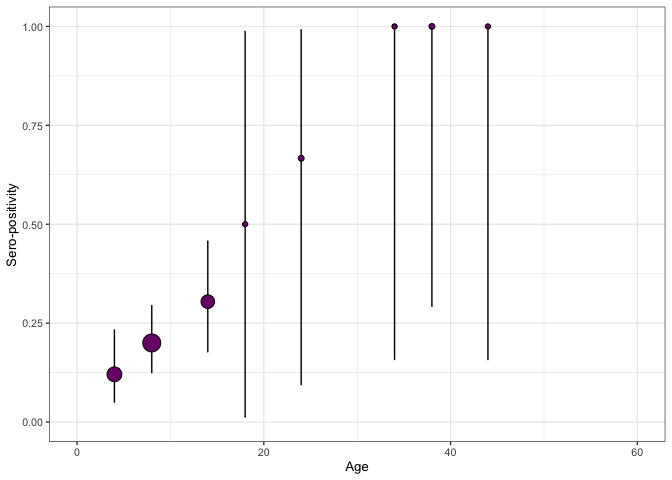

## *serofoi*: force-of-infection from population based serosurveys with age-disagregated data 

<!-- badges: start -->

[](https://opensource.org/licenses/MIT)
[](https://github.com/TRACE-LAC/serofoi/actions/workflows/R-CMD-check.yaml)
[](https://app.codecov.io/gh/TRACE-LAC/serofoi/tree/dev/R?displayType=list)
[](https://www.reconverse.org/lifecycle.html#concept)

<!-- badges: end -->

***serofoi*** is an R package to estimates the *Force-of-Infection* of a
given pathogen from age-disaggregated population based sero-prevalence
studies, using a Bayesian framework.

***serofoi*** implements methods outlined in (Cucunubá et al.
[2017](#ref-cucunubá2017)) and (Carrera et al. [2020](#ref-carrera2020))

***serofoi*** relies on
[`rstan`](https://mc-stan.org/users/interfaces/rstan)

***serofoi*** is part of the [Epiverse
Initiative](https://data.org/initiatives/epiverse/).

## Installation

You can install the **development version** of `serofoi` from
[GitHub](https://github.com/) with:

``` r
# install.packages("remotes")
# remotes::install_github("TRACE-LAC/serofoi")
library(serofoi)
```

## Quick start

The package provides an example dataset of the observed serosurvey data,
`serodata`. This example is the basic entry for the package.

``` r

# Load example serodata data included with the package
data(serodata)
head(serodata, 5)
#>       survey total counts age_min age_max tsur country  test
#> 1 COL-035-93    34      0       1       1 2012     COL ELISA
#> 2 COL-035-93    25      0       2       2 2012     COL ELISA
#> 3 COL-035-93    35      1       3       3 2012     COL ELISA
#> 4 COL-035-93    29      0       4       4 2012     COL ELISA
#> 5 COL-035-93    36      0       5       5 2012     COL ELISA
#>           antibody
#> 1 IgG anti-T.cruzi
#> 2 IgG anti-T.cruzi
#> 3 IgG anti-T.cruzi
#> 4 IgG anti-T.cruzi
#> 5 IgG anti-T.cruzi
```

The function `prepare_serodata` will prepare the entry data for
entering the modelling functions. The seroprevalence *prepared data* can
be visualised with the `plot_seroprev` function. This function also
plots the binomial confidence interval of the observed data.

``` r

data_test <- prepare_serodata(serodata)

plot_seroprev(data_test, size_text = 15)
```



#### Current version of the package runs ***three*** different FoI models

The `run_seromodel` function allows specifying the Bayesian model
from *R*, while running in the back from `rstan`. The number of
iterations, thinning, and other parameters can be customised.

<div class="alert alert-primary">

NOTE: Running the *serofoi* models for the first time on your local
computer make take a few minutes while the *rstan* code is compiled
locally. Afterwards, no further local compilation is needed.

</div>

#### Model 1. Constant Force-of-Infection (endemic model)

For the *endemic model* a small number of iterations is enough for
achieving convergence, as it only fits one parameter (the constant FoI)
from a binomial distribution.

``` r
model_1 <- run_seromodel(serodata = data_test,
                     foi_model = "constant",
                     n_iters = 500, 
                     n_thin = 2)
#> [1] "serofoi model constant finished running ------"
#>                     [,1]              
#> foi_model "constant" 
#> dataset             "COL-035-93"      
#> country             "COL"             
#> year                "2012"            
#> test                "ELISA"           
#> antibody            "IgG anti-T.cruzi"
#> n_sample            "747"             
#> n_agec              "72"              
#> n_iter              "500"             
#> elpd                "-92.88"          
#> se                  "6.44"            
#> converged           "Yes"
```

#### Model 2. Time-varying Force-of-Infection (epidemic model)

For the *epidemic model,* a larger number of iterations is required for
achieving convergence, as it fits yearly FoI values from a binomial
distribution. The number of iterations required may depend on the number
of years, reflected by the difference between year of the serosurvey and
the maximum age-class sampled.

``` r
model_2 <- run_seromodel(serodata = data_test,
                     foi_model = "tv_normal",
                     n_iters = 1500, 
                     n_thin = 2)
#> [1] "serofoi model tv_normal finished running ------"
#>                     [,1]                      
#> foi_model "tv_normal"
#> dataset             "COL-035-93"              
#> country             "COL"                     
#> year                "2012"                    
#> test                "ELISA"                   
#> antibody            "IgG anti-T.cruzi"        
#> n_sample            "747"                     
#> n_agec              "72"                      
#> n_iter              "1500"                    
#> elpd                "-74.69"                  
#> se                  "5.83"                    
#> converged           "Yes"
```

#### Model 3. Time-varying Force-of-Infection (fast epidemic model)

For the *fast* *epidemic model,* a larger number of iterations is
required for achieving convergence, compared to the previous models.

``` r
model_3 <- run_seromodel(serodata = data_test,
                        foi_model = "tv_normal_log",
                        n_iters = 1500, 
                        n_thin = 2)
#> [1] "serofoi model tv_normal_log finished running ------"
#>                     [,1]                       
#> foi_model "tv_normal_log"
#> dataset             "COL-035-93"               
#> country             "COL"                      
#> year                "2012"                     
#> test                "ELISA"                    
#> antibody            "IgG anti-T.cruzi"         
#> n_sample            "747"                      
#> n_agec              "72"                       
#> n_iter              "1500"                     
#> elpd                "-72.22"                   
#> se                  "7.15"                     
#> converged           "Yes"
```

For each model, the plot\_seroprev\_model function generate a vertical
arrange of plots summarising the results of the model implementation
plotting functions. Crucially, it shows the (expected) log-predictive
density `elpd`, standard error `se`, and allows to check convergence
based on `R-hat` convergence diagnostics.

Also, the `plot_seromodels_grid` allows a visual a comparison of
the models based on the (expected) log-predictive density `elpd`,
standard error `se`, and allows to check convergence based on `R-hat`
convergence diagnostics.

For more detailed information and examples, please check the [online
documentation](https://epiverse-trace.github.io/serofoi/articles) as
package vignettes under Get Started.

### Contributions

Contributors to the project include:

  - [Zulma M. Cucunubá](https://github.com/zmcucunuba) (author,
    maintainer)

  - [Nicolás Tórres](https://github.com/ntorresd) (author)

  - [Benjamin Lambert](https://ben-lambert.com/about/) (author)

  - [Pierre Nouvellet](https://github.com/pnouvellet) (author)

  - [Miguel Gamez](https://github.com/megamezl) (contributor)

  - [Geraldine Gómez](https://github.com/megamezl) (contributor)

  - [Jaime A. Pavlich-Mariscal](https://github.com/jpavlich)
    (contributor)

## Package vignettes

More details on how to use ***serofoi*** can be found in the [online
documentation as package
vignettes](https://epiverse-trace.github.io/serofoi/), under “Get
Started”.

## Help

To report a bug please open an
[issue](https://github.com/epiverse-trace/serofoi/issues/new/choose).

## Contribute

Contributions to ***serofoi*** are welcomed. Please follow the [package
contributing
guide](https://github.com/epiverse-trace/serofoi/blob/main/.github/CONTRIBUTING.md).

## Code of conduct

Please note that the ***serofoi*** project is released with a
[Contributor Code of
Conduct](https://github.com/epiverse-trace/.github/blob/main/CODE_OF_CONDUCT.md).
By contributing to this project, you agree to abide by its terms.

## References

<div id="refs" class="references hanging-indent">

<div id="ref-carrera2020">

Carrera, Jean-Paul, Zulma M. Cucunubá, Karen Neira, Ben Lambert, Yaneth
Pittí, Jesus Liscano, Jorge L. Garzón, et al. 2020. “Endemic and
Epidemic Human Alphavirus Infections in Eastern Panama: An Analysis of
Population-Based Cross-Sectional Surveys.” *The American Journal of
Tropical Medicine and Hygiene* 103 (6): 2429–37.
<https://doi.org/10.4269/ajtmh.20-0408>.

</div>

<div id="ref-cucunubá2017">

Cucunubá, Zulma M, Pierre Nouvellet, Lesong Conteh, Mauricio Javier
Vera, Victor Manuel Angulo, Juan Carlos Dib, Gabriel Jaime Parra -Henao,
and María Gloria Basáñez. 2017. “Modelling Historical Changes in the
Force-of-Infection of Chagas Disease to Inform Control and Elimination
Programmes: Application in Colombia.” *BMJ Global Health* 2 (3):
e000345. <https://doi.org/10.1136/bmjgh-2017-000345>.

</div>

</div>
