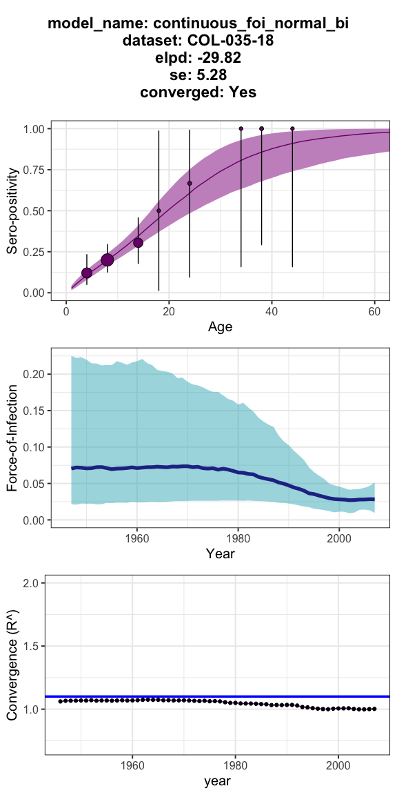

## *serofoi* 

An R package to estimates the *Force-of-Infection* of a given pathogen
from age-disaggregated population based sero-prevalence studies on a
Bayesian framework using
[`rstan`](https://mc-stan.org/users/interfaces/rstan).

<!-- badges: start -->

[](https://opensource.org/licenses/MIT)
[](https://github.com/TRACE-LAC/serofoi/actions/workflows/R-CMD-check.yaml)
[](https://github.com/TRACE-LAC/serofoi?branch=bugfixes-jaime)

[](https://www.reconverse.org/lifecycle.html#concept)

<!-- badges: end -->

## Installation

You can install the **development version** of `serofoi` from
[GitHub](https://github.com/) with:

``` r
# install.packages("remotes")
remotes::install_github("TRACE-LAC/serofoi")
library(serofoi)
```

## Quick start

The package provides an example dataset of the observed serosurvey data,
`mydata`. This example is the basic entry for the package.

``` r
head(mydata)
#>       survey total counts age_min age_max year_init year_end tsur country
#> 1 COL-035-18     2      0       1       1      2007     2007 2007     COL
#> 2 COL-035-18     1      0       2       2      2007     2007 2007     COL
#> 3 COL-035-18    13      2       4       4      2007     2007 2007     COL
#> 4 COL-035-18    25      5       5       5      2007     2007 2007     COL
#> 5 COL-035-18    17      0       6       6      2007     2007 2007     COL
#> 6 COL-035-18    20      4       7       7      2007     2007 2007     COL
#>      test antibody
#> 1 ELISA .      IgG
#> 2 ELISA .      IgG
#> 3 ELISA .      IgG
#> 4 ELISA .      IgG
#> 5 ELISA .      IgG
#> 6 ELISA .      IgG
```

The function `prepare_data` will prepare the entry data for entering the
modelling functions. The seroprevalence *prepared data* can be
visualised with the `plot_seroprev` function. This function also plots
the binomial confidence interval of the observed data.

``` r

data_test <- prepare_data(mydata)

plot_seroprev(data_test, size_text = 10)
```


### Current version of the package runs ***three*** different FoI models

The `run_model` function allows specifying the Bayesian model from *R*,
while running in the back from `rstan`. The number of iterations,
thinning, and other parameters can be customised.

***NOTE**: Running the models <u>for the first time</u> on your local
computer make take a few minutes as this is the first time the rstan
code is compiled locally.*

##### Model 1. Constant Force-of-Infection (endemic model)

For the *endemic model* a small number of iterations is enough for
achieving convergence, as it only fits one parameter (the constant FoI)
from a binomial distribution.

``` r
model_1 <- run_model(model_data = data_test,
                     model_name = "constant_foi_bi",
                     n_iters = 500, 
                     n_thin = 2)
#> [1] "serofoi model constant_foi_bi finished running ------"
#>            [,1]             
#> model_name "constant_foi_bi"
#> dataset    "COL-035-18"     
#> country    "COL"            
#> year       "2007"           
#> test       "ELISA ."        
#> antibody   "IgG"            
#> n_sample   "212"            
#> n_agec     "27"             
#> n_iter     "500"            
#> elpd       "-30.85"         
#> se         "4.9"            
#> converged  "Yes"
```

##### Model 2. Time-varying Force-of-Infection (epidemic model)

For the *epidemic model,* a larger number of iterations is required for
achieving convergence, as it fits a yearly FoI from a binomial
distribution. The number of iterations required may depend on the number
of years reflected by the difference between year of the serosurvey and
the maximum age-class sampled.

``` r
model_2 <- run_model(model_data = data_test,
                     model_name = "continuous_foi_normal_bi",
                     n_iters = 1500, 
                     n_thin = 2)
#> [1] "serofoi model continuous_foi_normal_bi finished running ------"
#>            [,1]                      
#> model_name "continuous_foi_normal_bi"
#> dataset    "COL-035-18"              
#> country    "COL"                     
#> year       "2007"                    
#> test       "ELISA ."                 
#> antibody   "IgG"                     
#> n_sample   "212"                     
#> n_agec     "27"                      
#> n_iter     "1500"                    
#> elpd       "-29.82"                  
#> se         "5.28"                    
#> converged  "Yes"
```

##### Model 3. Time-varying Force-of-Infection with a (fast epidemic model)

For the *epidemic model,* a larger number of iterations is required for
achieving convergence, compared to the previous ones, as it fits a
yearly FoI from a normal distribution with log superprior. As with the
endemic model, the number of iterations required may depend on the
number of years reflected by the difference between year of the
serosurvey and the maximum age-class sampled.

``` r
model_3 <- run_model(model_data = data_test,
                     model_name = "continuous_foi_normal_log",
                     n_iters = 1500, 
                     n_thin = 2)
#> [1] "serofoi model continuous_foi_normal_log finished running ------"
#>            [,1]                       
#> model_name "continuous_foi_normal_log"
#> dataset    "COL-035-18"               
#> country    "COL"                      
#> year       "2007"                     
#> test       "ELISA ."                  
#> antibody   "IgG"                      
#> n_sample   "212"                      
#> n_agec     "27"                       
#> n_iter     "1500"                     
#> elpd       "-29.73"                   
#> se         "5.53"                     
#> converged  "Yes"
```

For each model, the plot_model function generate a vertical arrange of
plots summarising the results of the model implementation ploting
functions. Crutially, it shows the (expected) log-predictive density
`elpd`, standard error `se`, and allows to check convergence based on
**`R`**`-hat` convergence diagnostics.

``` r

plot_model(model_2, size_text = 10)
```



Also, the `plot_models_list` allows a visual a comparison of the models
based on convergence, elpd and p-values

For mre information, please check detailed mathematical formulation of
the models on

### Lifecycle

This package is currently a *concept*, as defined by the [RECON software
lifecycle](https://www.reconverse.org/lifecycle.html). This means that
essential features and mechanisms are still being developed, and the
package is not ready for use outside of the development team.

### Contributions

Contributions are welcome via [pull
requests](https://github.com/TRACE-LAC/serofoi/pulls).

Contributors to the project include:

- [Zulma M. Cucunubá](https://github.com/zmcucunuba) (author)

- \[Nicolás Tórres\] (author)

- \[Benjamin Lambert\] (author)

- \[Pierre Nouvellet\] (author)

- [Miguel Gamez](https://github.com/megamezl) (contributor)

- [Geraldine Gómez](https://github.com/megamezl) (contributor)

- [Jaime A. Pavlich-Mariscal](https://github.com/jpavlich) (contributor)

### Code of Conduct

Please note that the linelist project is released with a [Contributor
Code of
Conduct](https://contributor-covenant.org/version/2/0/CODE_OF_CONDUCT.html).
By contributing to this project, you agree to abide by its terms.
